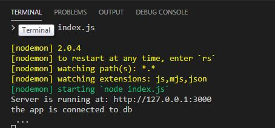
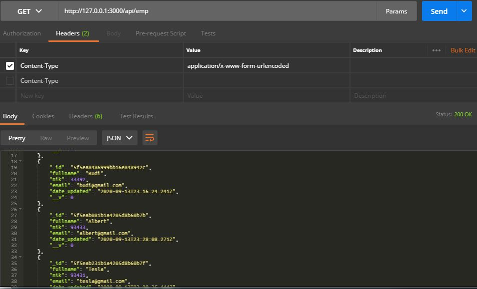
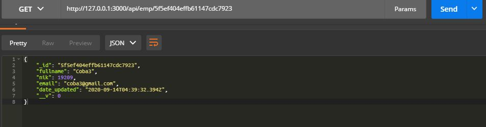
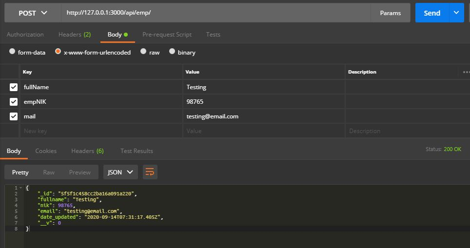
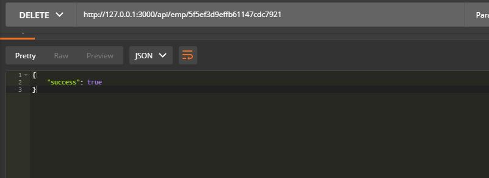
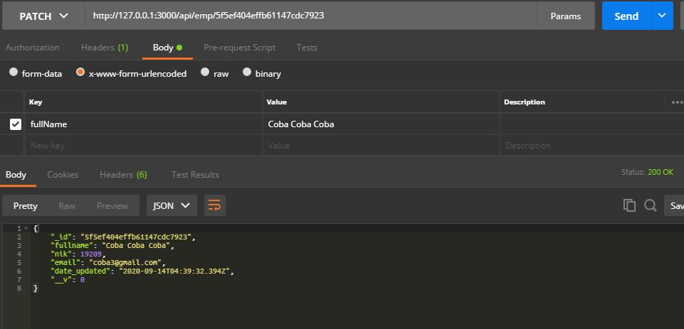
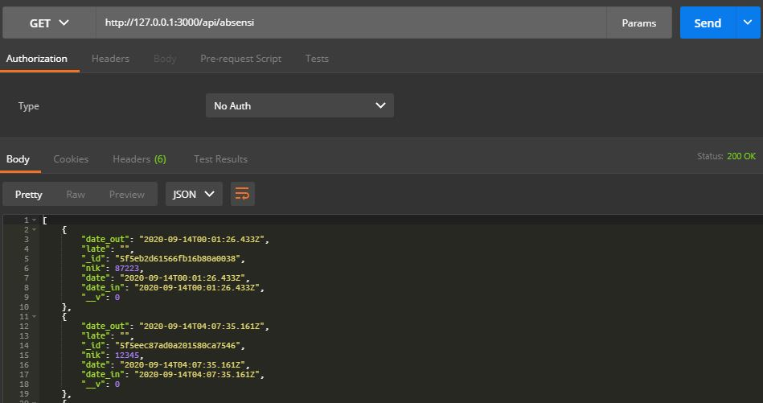
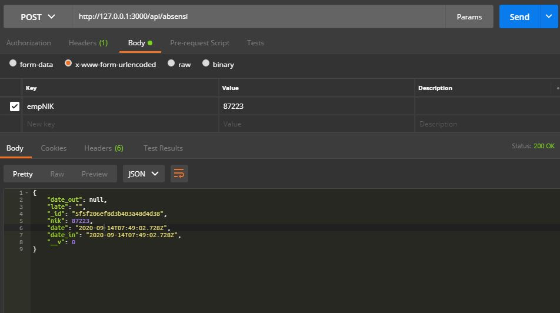

### Tested on:
- Windows 7 Ultimate
- Visual Studio Code v 1.49.*
- MongoDB Compass & MongoDB Shell v 4.2.9
- Postman

### Installation
```
git clone https://github.com/immsswd/restapi.git
```
point out the package.json and see the **dependencies**, to install all the dependencies:
```
npm install --save
```

to run the application:
```bash
npm run dev
```

use json collections data from `collections/*.json`

### REST API
rest api using nodejs (expressJS), MongoDB, Postman

### Endpoint and Verbs

| Endpoint  |Verbs   |Desc   |
|---|---|---|
| http://127.0.0.1:3000/api/emp  |GET   | get datas of all employees  |
| http://127.0.0.1:3000/api/emp/:id  |GET   | get employee's data based on id|
| http://127.0.0.1:3000/api/emp  |POST   | Create a new employee data (fullname, nik, email) in postman  |
| http://127.0.0.1:3000/api/emp/:id  |DELETE   | Delete employee's data according to pointed id  |
| http://127.0.0.1:3000/api/emp/:id |PATCH   | Update employee's data  |

#### TESTING:

##### Employees
1. Testing


2. `/api/emp` GET all data


3. `/api/emp/:id` GET data based on id


4. `/api/emp` POST create new data


5. `/api/emp/:id` DELETE remove a data


6. `/api/emp/:id` PATCH updating a data



##### Absensi
1. `/api/absensi` GET all data


1. `/api/absensi` POST create new data
